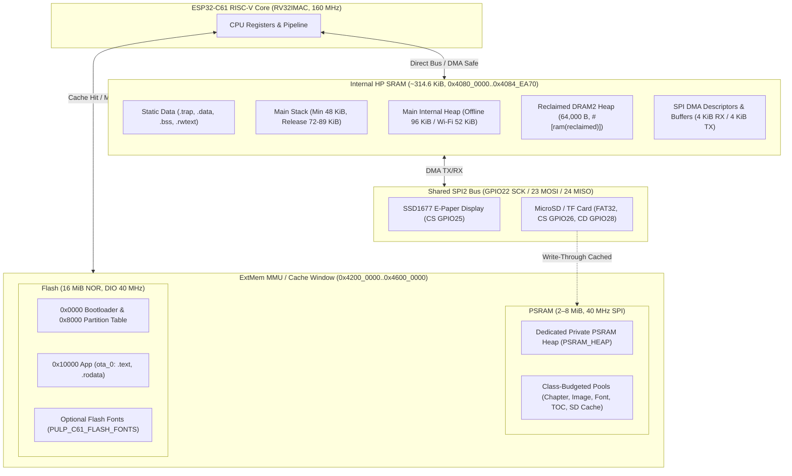

# ESP32-C61 (OnePage) Memory Hierarchy

A technical one-page architectural specification of the memory hierarchy in `pulp-os` for the ESP32-C61 (OnePage) board.

---

## 1. Memory Tier Overview

| Tier | Media | Size / Bus | Range | Allocator / Driver | Safety & Usage |
|---|---|---|---|---|---|
| **L1 SRAM** | On-chip HP SRAM | ~314.6 KiB (No cache required) | `0x4080_0000`–`0x4084_EA70` | Global `esp_alloc::HEAP`, Linker | DMA buffers, ISR data, task stacks, runtime state |
| **L2 PSRAM** | ExtMem SPI PSRAM | 2 MiB (HR2) – 8 MiB (HR8) @ 40 MHz | `0x4200_0000`–`0x4600_0000` (dynamic) | Private `PSRAM_HEAP` | Decompressed text, decoded images, font caches, SD sector cache |
| **L3 Flash** | SPI NOR Flash | 16 MB DIO @ 40 MHz | `0x4200_0000`–`0x4600_0000` (mapped) | MMU (XIP / DROM / IROM) | Executable code, read-only data, optional embedded fonts |
| **L4 SD Card**| MicroSD (FAT32) | Variable (SPI2 @ 20 MHz) | External block device | `embedded-sdmmc` | Books (EPUB/TXT), CJK font packs (`.PFN`), bookmarks, settings |

---

## 2. SRAM (Internal HP SRAM)

- **Memory Map**:
  - `C61_RAM_START` (`0x4080_0000`) to `0x4083_EA70` (250.6 KiB): Holds `.trap`, `.rwtext`, `.data`, `.bss`, task pools, and `.stack`.
  - `C61_RECLAIMED_START` (`0x4083_EA70`) to `0x4084_EA70` (64 KiB `dram2_seg`): 2nd-stage bootloader RAM reclaimed after boot.
  - Total usable: **~314.6 KiB**.
- **Internal Heap Layout**:
  - **Offline Profile**: 96 KiB main heap + 64,000 B reclaimed heap = **~158.5 KiB**.
  - **Wi-Fi Profile**: 52 KiB main heap + 64,000 B reclaimed heap = **~114.5 KiB** (Wi-Fi radio static RAM consumes ~68 KiB).
- **Stack Budget**:
  - Minimum hard limit: `STACK_MIN_BYTES = 48 KiB`.
  - Typical measured release allocation: **72.6 KiB** (Wi-Fi) to **89.0 KiB** (offline).
- **Internal-Only Memory Classes**:
  - `DmaBuffer` (Limit 16 KiB, 4-byte aligned): Strictly allocated via `alloc_dma()`. Address verified within `[C61_RAM_START, C61_RAM_END)`. Used for SPI DMA 4 KiB RX / 4 KiB TX buffers and descriptors.
  - `IsrData` (Limit 4 KiB): Accessible with cache disabled.
  - `Runtime` (Limit 32 KiB): Embassy executor arena (~14.6 KiB POOL), task state, critical section primitives.
- **Strict Isolation**: Global allocator `esp_alloc::HEAP` **never** maps PSRAM. Plain `Box`/`Vec` cannot silently fall back into external memory.

---

## 3. PSRAM (External SPI RAM)

- **Hardware Specs**: 2 MiB (ESP32-C61HR2) or 8 MiB (ESP32-C61HR8) clocked at 40 MHz (aligned with Flash clock to avoid clock domain contention).
- **Allocator Management**: Registered on an isolated `PSRAM_HEAP: EspHeap`. Direct access is strictly guarded by `alloc_external(ExternalClass)` and tracked through `MemoryBudget`.
- **Class Budgeting & Partitioning**:

| Memory Class | HR2 Limit (2 MiB) | HR8 Limit (8 MiB) | Degraded (Internal) | Backed Components |
|---|---|---|---|---|
| `ChapterText` | 256 KiB | 1,024 KiB | 96 KiB | Ring buffer (`EpubState.ring`), inflate window (32 KiB), prefetch (8 KiB) |
| `ImageData` | 512 KiB | 2,048 KiB | 112 KiB | Decoded 1bpp frames (48 KiB), decoder scratch, image LRU (up to 384 KiB) |
| `PageTable` | 64 KiB | 256 KiB | 8 KiB | Dynamic page offset indices, wrap points, style markers |
| `ZipToc` | 256 KiB | 512 KiB | 32 KiB | ZIP central directory, entry tables, EPUB TOC, directory cache |
| `FontGlyphs` | 256 KiB | 2,048 KiB | 16 KiB | CJK rasterized glyph slot cache, full PFN pack indices |
| `NetScratch` | 32 KiB | 256 KiB | 16 KiB | Wi-Fi upload session buffers (HTTP scratch, TCP RX/TX) |
| `DisplayFrame`| 128 KiB | 128 KiB | 0 KiB | Differential partial refresh immutable snapshots |
| `StorageCache`| 128 KiB | 128 KiB | 16 KiB | SD 4-way set-associative write-through sector cache |
| *Reserve* | 192 KiB | 192 KiB | — | Headroom & heap tracking metadata |

- **Fault Tolerance (Degraded Mode)**:
  - If PSRAM detection or startup self-test (`selftest`) fails, status transitions to `Degraded`.
  - PSRAM heap is not initialized; all classes fall back to tight internal SRAM budgets (X4-equivalent) without panicking.

---

## 4. Flash (External SPI NOR Flash)

- **Capacity & Bus**: 16 MB SPI Flash, DIO mode @ 40 MHz.
- **MMU Mapping**: Mapped into CPU address space (`0x4200_0000`..`0x4600_0000`) for Execute-In-Place (XIP) and direct rodata access.
- **Partitions**:
  - `0x0000_0000`: Factory 2nd-stage bootloader (preserved by `scripts/run-c61.sh`).
  - `0x0000_8000`: Partition Table (OTA layout).
  - `0x0001_0000`: App partition (`ota_0`).
- **Embedded Flash Fonts**:
  - Optional compile-time font packing via `PULP_C61_FLASH_FONTS`.
  - PFN packs are embedded directly into `.rodata` within mapped flash space (max 4 MiB ROM limit), bypassing SD card lookups.

---

## 5. SD Card (Mass Storage)

- **Interface**: Shared SPI2 bus (`GPIO22` SCK, `GPIO23` MOSI, `GPIO24` MISO, `GPIO26` CS).
  - Probe frequency: 400 kHz; Operational frequency: 20 MHz.
- **Hardware Isolation & Power Management**:
  - `GPIO27` rail controls peripheral power for SD and microphone (`PeripheralPower`).
  - `GPIO28` detects card insertion (low = inserted, debounced 3 samples @ 20 ms).
  - SPI bus shared with SSD1677 EPD via `CriticalSectionDevice`: SD operations finish completely before display render passes.
- **PSRAM Sector Cache (`StorageCache`)**:
  - 4-way set-associative write-through cache: 2 protected ways + 2 probation ways.
  - Standard size: 64 KiB (HR2) or 128 KiB (HR8); 512-byte sector granularity.
  - Prevents sequential scans (EPUB decompression) from thrashing frequently accessed FAT and directory sectors.
- **On-Disk File Layout**:
  - Books: `/` and subdirectories (EPUB, TXT).
  - CJK font packs: `_PULP/FONTS/*.PFN`, `PROV.TXT`, `COVERAGE.TXT`, `BUNDLE.JSON`, `OFL.TXT`.
  - Configuration: `_PULP/SETTINGS.TXT` (plain text key-value).
  - Bookmarks: `_PULP/BOOKMARK.BIN` (16-slot LRU binary cache, flushed every 30 s and upon sleep).
